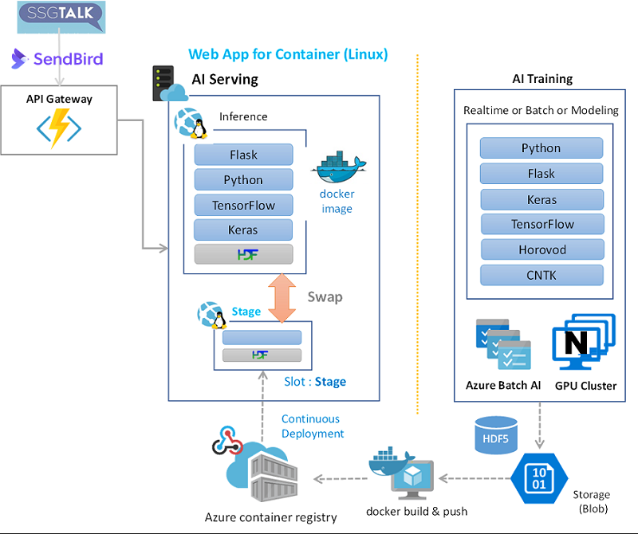
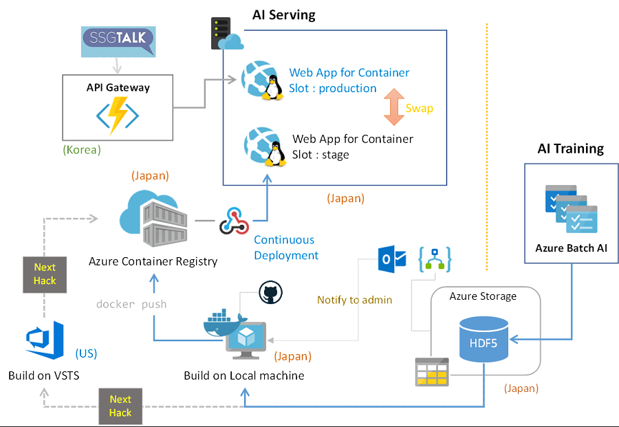

#SSG AI Chatbot with Deep Learning Hack

## Key technologies
The technologies outlined and included in this solution are:
- Azure Batch and Batch AI to train deep learning training 
- Azure Logic App to notify changes of trained model 
- Web App for Container on Linux to host AI inference Service
- Private container registry using Azure Container Registry.
- Continuous deployment using Container WebHook from Azure Container Registry to Web App for Container  
- Deployment Slot for staging/production environments swap in Web App for Container
- Azure Functions to host API Gateway(customer's Chatbot) with Serverless Architecture
- Continuous deployment with Github Private Repository
- Cosmos DB (SQL) for managing state of end users
- Azure Storage Queue for Reactive communication between Azure Functions
- Application Insight to monitor performance and usage of API gateway

## Core Team
The team was comprised of members from SSG AI team and Microsoft CSE:
- Hoondong Kim
- Hun Choi
- .
- .

## Partner profile
Shinsegae is The largest retailer in South Korea with E-Mart(160 stores across the country), Shinsegae department stores, TRADERS as their subsidiary. Also, SSG.COM, integrated e-commerce service for their subsidiaries’ e-commerce site, growing fast ($800M revenue, 37.6% YoY growth in CY16)  …  

## Problem statement

고객은 기존의 모든 서비스를 Azure의 VM 상에서 서비스를 테스트를 하고 있었는데, 크게는 총 4개의 영역으로서, 각각 AI Traing 영역과 AI Serving(Inference) 영역, API Gateway(Chatbot App) 영역, Admin Management Web 영역으로 나누어져 있었다. 모든 서비스들이 현재 VM에서 운영되고 있는데 추후 규모가 커질 경우 관리해야 할 VM의 수가 늘어날 수 있다는 부분이 우려스러웠으며, AI Training 서비스의 경우 상시 운영해야 할 이유도 없는데 GPU가 지원되는 VM을 계속 사용해야만 하는 상황이 부담스러웠다. 해서, 고객은 가급적 모든 서비스를 Managed Service 환경, 즉 PaaS 환경으로 새로이 아키텍처를 변경하고 싶어했으며, AI Serving 영역의 경우는 사전 테스트를 통해서 굳이 GPU가 필요하지 않다는 결론에 도출하여 이 기회에 Azure App Service를 적용하고 Web App의 수많은 훌륭한 기능들(자동 배포, 배포 슬롯 등)을 활용하고 싶어했다. 또한, Chatbot App에 해당하는 API Gateway 영역 역시 마이크로서비스나 서버리스 아키텍처를 도입해서 개발자들이 개별 로직에만 집중할 수 있도록 개선하고 싶어했다. 더불어, 기존에는 모든 서비스로 앱을 배포하는 부분이 수동으로 이루어지고 있었는데 이러한 반복 배포 작업이 비효율적이기에 이번 핵페스트를 통해서 가능한 한 많은 부분에 Continuous Deployment가 가능한지를 검증하기 원했다. 기존의 고객사 아키텍처는 대략 다음과 같다.

<기존 아키텍처>

## Requirements and goals
For this technical engagement, we defined these milestones before the hackfest:
	
- Customer doesn’t want to worry about Infra and VMs anymore
- Customer wants flexible and scalable Architecture
- Customer wants C/D strategy and easy maintenance
- Customer want to analysis call logs and have visibility

## Technical Delivery

## Architectural Decisions & Solutions

각각의 기술 영역에 대해서 고객과 MS 엔지니어들은 다음과 같은 설계를 결정하였다.

### AI Model Traininig Layer
이하 내용 추가

### **AI Inference(& Serving) Layer**

#### As-Is 

AI Serving Layer는 AI inference 역할을 수행하는 웹 서비스로, 기존에는 Python 언어로 개발되어 있었으며, DSVM의 Ubuntu 머신 내 Flask 웹 서버 상에서 운영 중에 있었습니다(개발환경은 jupyter 노트북을 사용). 사용하는 라이브러리는 tensorflow(1.3.0), keras(2.0.8), python-twitter 등 입니다.

#### What they want

기존 운영 방식은 별도의 Single VM에서 Model(.H5) 바이너리 파일(Deep Learning 서비스를 통해서 Trained 된 모델)을 h5py 라이브러리를 사용하여 메모리에 통채로 올려서 서비스를 제공하는 방식이었기에, 기본적으로 구동시키는 데에 메모리를 최소 2G(trained model의 size가 약 1.7G) 이상 소비하는 구조로 되어 있었습니다. 기존의 아키텍처는 이를 1대의 DSVM에서 운영하도록 설계가 되어 있었습니다만(일종의 검증 상황이었기에 AV SET 없이 Single VM으로 운영), 실제로 운영을 위해서는 고객은 아키텍처를 다시 설계하여 보다 나은 구조가 필요하다고 판단하였습니다.

해서, 아키텍처에 대해 논의하던 중, 고객은 자체적으로 사전에 성능 테스트를 수행하였고 그 결과 그들이 개발한 AI Serving Layer는 GPU보다는 CPU 환경에서 더욱 빠르게 동작한다는 결론을 얻었습니다(하단의 Refer 참고) 그렇기에 GPU VM을 사용하는 시나리오에서 벗어나 Azure PaaS(App Service) 환경을 사용하여 관리 편의성과 Scalability, Flexability를 얻는 쪽의 아키텍처를 검토하게 되었습니다.

> Refer to [Experiment and Performance Test for Deep Learning Inference & Serving : > GPU vs CPU (Korean)](http://hoondongkim.blogspot.jp/2017/12/deep-learning-inference-serving.html)
>   - blog post by Hoondong Kim(SSG Chief Dev, AI Data platform team) 
>	- Topic : Is GPU really better than CPU in AI Inference?
>   - Conclusion : CPU is better than GPU in their cases.

#### Analysis and Design 

Envisioning Plan 미팅 시에 나왔던 방안은 Web App(Windows)의 KUDU(SCM) 환경에서 필요한 python 라이브러리들을 미리 Web App에 설치하고 Web App 환경이 주는 수많은 혜택들(Continuous Deployment, Auto Scale, Deployment Slot, App Service Environment etc)을 활용하고자 하였으나, 개발에 사용된 라이브러리들이 모두 Linux 기반의 라이브러리들이기에 가급적이면 OS로 Linux를 사용하는 것이 바람직하다는 의견이 제시되었고, TWG - Compute 그룹과의 기술 미팅에서도 이 부분의 아키텍처는 Container 기반으로 가져가는 것이 좋아보인다는 의견이 제시되어 최종 아키텍처는 Web App for Container로 진행하기로 하였습니다(Web App for Container는 아직 Web App의 모든 features들이 가용하지는 않지만 고객사에서 요구한 배포 슬롯과 C/D은 사용 가능하기에 적합한 시나리오로 채택되었습니다). 이를 통해 설계된 아키텍처는 다음과 같습니다.

다만, 이번 핵페스트에서는 VSTS를 활용한 Docker build, Push의 자동화는 배제하기로 하였는데, 이는 고객사의 QA 정책과 관련하여 이슈들(Test 및 QA 관련 이슈)이 발생할 가능성이 있어서, 별도의 Docker Build 머신(VM)에서 로컬 테스트를 수행한 다음에 수동으로 ACR에 Push를 하는 것으로 고객과 협의하였습니다.

#### Continuous Deployment Scenario

핵페스트에 앞서, TE는 약 2-3일에 걸쳐 시나리오의 가능성을 사전 검토했으며, 실제 핵페스트 기간 중에는 2일간 고객과 함께 기존 시스템을 Container 기반으로 재구축하여 Web App for Container에서 구동시키는 데 성공했습니다. Docker Images를 위한 Private Registry로는 Web App for Container와 같은 Region에 있는 Azure Container Registry를 사용했으며, Registry Webhook을 설정하여 새로운 Docker Image 가 Push되면, 자동으로 Web App의 Stage Slot에 배포되도록 하였습니다. 그리고, 배포가 완료되면 고객의 담당자가 각 Slot의 상태를 체크한 뒤에, Swap을 수동으로 진행하게 됩니다. 이렇게 정의된 CD 시나리오는 다음과 같습니다.

### API Gateway(Chatbot App) Layer
이하 내용 추가

### Admin management Web Layer
이하 내용 추가

## Business impact
이하 내용 추가

## Partner technical engagement feedback
이하 내용 추가

## Conclusion
이하 내용 추가

## Future possibilities
이하 내용 추가
